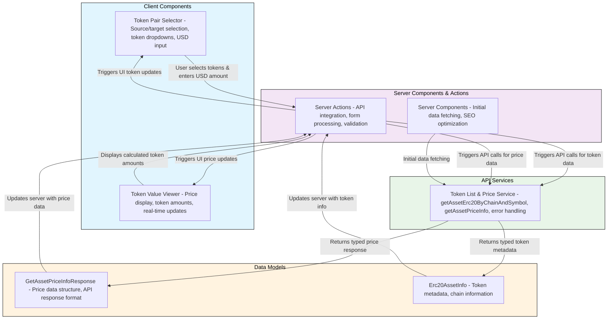

# Crypto Token Price Explorer

Tool feature for selecting tokens to swap with server-side API integration

## Requirements

### Functional

1. **Token Selection Interface**

   - Allow users to select a source token from a predefined list
   - Allow users to select a target token from a predefined list
   - Display token symbols and names clearly
   - Support at minimum: USDC (Chain 1), USDT (Chain 137), ETH (Chain 8453), WBTC (Chain 1)

2. **USD Amount Input**

   - Provide an input field for users to enter a USD amount
   - Validate input to ensure it's a positive number
   - Support decimal values for precise amounts

3. **Real-time Price Display**

   - Fetch and display current token prices using the @funkit/api-base package
   - Show the equivalent amount of source token for the entered USD value
   - Show the equivalent amount of target token for the entered USD value
   - Update prices in real-time or on user interaction

4. **API Integration**

   - Integrate with @funkit/api-base package for token information via server actions
   - Use getAssetErc20ByChainAndSymbol for token details
   - Use getAssetPriceInfo for price data
   - Handle API errors gracefully with user-friendly messages
   - Secure API key handling on the server side

5. **Token Information Display**

   - Show token addresses and chain IDs
   - Display token metadata (name, symbol, etc.)
   - Present information in a clear, organized format

6. **User Experience Features**
   - Clear visual distinction between source and target tokens
   - Intuitive layout following the provided wireframe
   - Responsive design for different screen sizes
   - Loading states during API calls
   - Optimistic UI updates with server-side validation

### Non-functional

1. **Performance**

   - Fast initial page load (< 3 seconds)
   - Responsive UI interactions (< 100ms)
   - Efficient API calls with proper caching
   - Optimized bundle size with Next.js optimizations

2. **Usability**

   - Intuitive user interface following modern UX patterns
   - Clear visual hierarchy and information architecture
   - Accessible design (WCAG 2.1 AA compliance)
   - Mobile-responsive design

3. **Reliability**

   - Graceful error handling for API failures
   - Fallback states for missing data
   - Input validation to prevent invalid operations
   - Consistent behavior across different browsers

4. **Maintainability**

   - Clean, well-structured React components
   - Proper separation of concerns with server/client components
   - Comprehensive error handling
   - Well-documented code

5. **Security**

   - Secure API key handling on the server side
   - Input sanitization to prevent XSS
   - HTTPS-only communication with APIs
   - Server-side validation of all inputs

6. **Scalability**

   - Modular component architecture
   - Easy to add new tokens to the supported list
   - Extensible design for future features
   - Efficient state management with React Server Components

7. **Technical Requirements**
   - Built with Next.js 15 App Router
   - Modern browser compatibility (Chrome, Firefox, Safari, Edge)
   - TypeScript for type safety
   - Proper build and deployment setup

## Tech Stack

### Core Framework

- **Next.js 15** - Full-stack React framework with App Router
- **React 19** - UI framework with TypeScript
- **TypeScript** - Type safety and developer experience

### State Management

- **React Server Components** - Server-side state management
- **React Hooks** - Client-side state management for UI interactions
- **Server Actions** - Form handling and API integration

### Styling

- **Tailwind CSS 4** - Utility-first CSS framework for responsive design

### Form Handling & Validation

- **React Hook Form** - Efficient form management with minimal re-renders
- **Zod** - Schema validation and runtime type checking
- **Server Actions** - Server-side form processing and validation

### Data Fetching & Caching

- **Next.js Server Actions** - Server-side API integration
- **@funkit/api-base** - Crypto token API integration
- **Next.js Cache** - Built-in caching for API responses

### UI Components & Icons

- **shadcn/ui** - Modern, accessible UI components built on Radix UI and Tailwind CSS
- **Lucide React** - Consistent icon library

### Utilities

- **clsx** - Conditional CSS class names
- **date-fns** - Date formatting utilities

### Development Tools

- **ESLint** - Code linting
- **Prettier** - Code formatting
- **pnpm** - Package manager
- **Turbopack** - Fast development server

## Project Architecture

### Module Interactions

1. **Client Layer**

   - **Token Pair Selector**: Handles user token selection and displays available tokens
   - **Token Value Viewer**: Displays current prices and calculated values based on USD input

2. **Server Layer**

   - **Server Actions**: Handle form submissions and API integration
     - Secure API key management
     - Server-side validation
     - Error handling and user feedback
   - **Server Components**: Initial data fetching and SEO optimization
     - Pre-fetch token metadata
     - Optimize for search engines
     - Reduce client-side JavaScript

3. **API Service Layer**

   - **Token List & Price Service**: API integration with @funkit/api-base
     - `getAssetErc20ByChainAndSymbol`: Fetches token metadata
     - `getAssetPriceInfo`: Retrieves current price information
     - Server-side caching for performance

4. **Data Models**
   - **GetAssetPriceInfoResponse**: Type definition for price API responses
   - **Erc20AssetInfo**: Type definition for token metadata

### Data Flow

1. **Initial Load**: Server Components fetch initial data → API Service → UI renders with data
2. **Token Selection**: User selects tokens → Server Action processes → API Service fetches new data → UI updates
3. **Price Updates**: Server Action triggers price refresh → API Service calls API → UI displays latest values
4. **Form Submission**: User submits form → Server Action validates → API Service processes → UI shows results

### Key Next.js Features Used

1. **App Router**: File-based routing with server and client components
2. **Server Actions**: Secure server-side form processing and API integration
3. **Server Components**: Initial data fetching and SEO optimization
4. **Client Components**: Interactive UI elements with client-side state
5. **Built-in Caching**: Automatic caching of API responses and static assets
6. **TypeScript Integration**: Full type safety across server and client code

### Security Benefits

1. **API Key Protection**: API keys stored securely on the server side
2. **Server-side Validation**: All inputs validated before processing
3. **XSS Prevention**: Automatic sanitization of user inputs
4. **CSRF Protection**: Built-in protection against cross-site request forgery

### Performance Benefits

1. **Reduced Bundle Size**: Server components reduce client-side JavaScript
2. **Faster Initial Load**: Server-side rendering provides immediate content
3. **Automatic Caching**: Next.js handles caching of API responses
4. **Optimized Assets**: Automatic image and asset optimization
