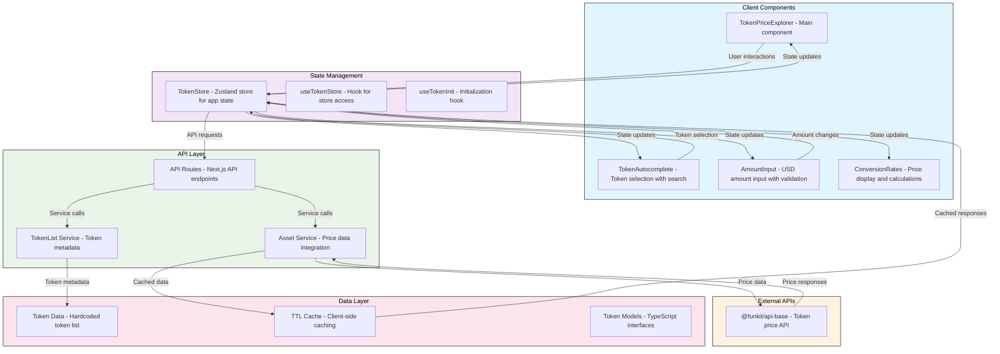

# Crypto Token Price Explorer

A modern web application for exploring token prices and performing token swaps with real-time price data from the @funkit/api-base package.

## Features

### Core Functionality

1. **Token Selection Interface**

   - Interactive token autocomplete with search functionality
   - Support for multiple chains (Ethereum, Polygon, Base)
   - Comprehensive token list with metadata (name, symbol, chain ID, logo)
   - Recommended tokens (USDC, USDT, ETH, WBTC) for quick access
   - Token swap functionality with visual swap button

2. **USD Amount Input**

   - Real-time input validation with Zod schema
   - Support for decimal values and comma formatting
   - Live token amount estimates as you type
   - Error handling for invalid inputs

3. **Real-time Price Display**

   - Current token prices fetched from @funkit/api-base
   - Live conversion rates between selected tokens
   - Token amount calculations based on USD input
   - Optimistic UI updates with loading states

4. **API Integration**

   - Server-side API integration with @funkit/api-base
   - Secure API key handling on the server side
   - Caching layer for improved performance
   - Graceful error handling with user-friendly messages

5. **Token Information Display**

   - Token metadata display (name, symbol, chain ID)
   - Token logos with fallback icons
   - Network-specific information
   - Clear visual distinction between source and target tokens

6. **User Experience Features**
   - Responsive design optimized for all screen sizes
   - Loading states during API calls
   - Toast notifications for errors and feedback
   - Intuitive token selection with search and filtering
   - Disabled state for already selected tokens

## Tech Stack

### Core Framework

- **Next.js 15** - Full-stack React framework with App Router
- **React 19** - UI framework with TypeScript
- **TypeScript** - Type safety and developer experience

### State Management

- **Zustand** - Lightweight state management for client-side state
- **React Hooks** - Local component state management

### Styling & UI

- **Tailwind CSS 4** - Utility-first CSS framework
- **shadcn/ui** - Modern, accessible UI components built on Radix UI
- **Lucide React** - Consistent icon library
- **Radix UI** - Headless UI primitives for accessibility

### Data Fetching & Caching

- **Next.js API Routes** - Server-side API endpoints
- **@funkit/api-base** - Crypto token API integration
- **Custom TTL Cache** - Client-side caching for API responses
- **Next.js Cache Headers** - Server-side caching

### Form Handling & Validation

- **Zod** - Schema validation and runtime type checking
- **Custom validation** - Real-time input validation

### Utilities

- **clsx** - Conditional CSS class names
- **lodash** - Utility functions (debounce)
- **tailwind-merge** - Tailwind class merging

### Development Tools

- **ESLint** - Code linting
- **Jest** - Testing framework
- **pnpm** - Package manager
- **Turbopack** - Fast development server

## Project Architecture



### Module Structure

```
src/
├── app/
│   ├── api/
│   │   ├── assets/
│   │   │   ├── route.ts              # Asset price API endpoint
│   │   │   ├── assets.service.ts     # Price data service
│   │   │   └── erc20/
│   │   │       └── route.ts          # ERC20 token metadata endpoint
│   │   └── tokenlist/
│   │       ├── route.ts              # Token list API endpoint
│   │       ├── tokenlist.service.ts  # Token list service
│   │       ├── tokenlist.data.ts     # Hardcoded token data
│   │       └── recommended/
│   │           └── route.ts          # Recommended tokens endpoint
│   ├── page.tsx                      # Main page component
│   └── layout.tsx                    # App layout
├── modules/
│   └── tokens/
│       ├── TokenPriceExplorer.tsx    # Main token explorer component
│       ├── components/
│       │   ├── TokenAutocomplete.tsx # Token selection component
│       │   ├── AmountInput.tsx       # USD amount input
│       │   ├── ConversionRates.tsx   # Price conversion display
│       │   └── NetworkImage.tsx      # Token logo component
│       ├── hooks/
│       │   ├── useTokenStore.ts      # Store access hook
│       │   └── useTokenInit.ts       # Initialization hook
│       ├── store/
│       │   └── tokenStore.ts         # Zustand store
│       └── services/
│           ├── assets.ts             # Asset API client
│           └── tokenlist.ts          # Token list API client
├── models/
│   └── token.ts                      # Token data models
├── lib/
│   ├── cache.ts                      # TTL cache implementation
│   ├── utils.ts                      # Utility functions
│   └── toast.ts                      # Toast notifications
└── config/
    └── server.ts                     # Server configuration
```

### Data Flow

1. **Initialization**: `useTokenInit` fetches recommended tokens → Store updates → UI renders
2. **Token Selection**: User selects token → Store updates → API fetches price data → UI updates
3. **Amount Input**: User enters USD amount → Validation → Store updates → UI recalculates
4. **Price Updates**: Store triggers price refresh → API calls → Cache updates → UI displays latest values

### Key Features

1. **Caching Strategy**

   - Client-side TTL cache for API responses
   - Server-side cache headers for static data
   - Optimized for performance and reduced API calls

2. **Error Handling**

   - Comprehensive error boundaries
   - User-friendly error messages
   - Graceful fallbacks for missing data

3. **Performance Optimizations**

   - Debounced search for token autocomplete
   - Optimistic UI updates
   - Efficient re-rendering with Zustand
   - Next.js optimizations (Turbopack, caching)

4. **Security**
   - API keys stored securely on server side
   - Input validation and sanitization
   - HTTPS-only communication

## Getting Started

### Prerequisites

- Node.js 18+
- pnpm package manager

### Installation

```bash
# Clone the repository
git clone <repository-url>
cd token-swap-nextjs

# Install dependencies
pnpm install

# Set up environment variables
cp .env.example .env.local
# Add your FUNKIT_API_KEY to .env.local

# Start development server
pnpm dev
```

### Environment Variables

```env
FUNKIT_API_KEY=your_api_key_here
```

### Available Scripts

- `pnpm dev` - Start development server with Turbopack
- `pnpm build` - Build for production
- `pnpm start` - Start production server
- `pnpm lint` - Run ESLint
- `pnpm test` - Run Jest tests

## API Endpoints

### `/api/assets`

- **GET**: Fetch asset price information
- **Parameters**: `assetTokenAddress`, `chainId`
- **Response**: Asset price data with unit price and amounts

### `/api/assets/erc20`

- **GET**: Fetch ERC20 token metadata
- **Parameters**: `chainId`, `symbol`
- **Response**: Token metadata including address and decimals

### `/api/tokenlist`

- **GET**: Fetch filtered token list
- **Parameters**: `query`, `limit`, `offset`
- **Response**: Paginated token list with metadata

### `/api/tokenlist/recommended`

- **GET**: Fetch recommended tokens
- **Response**: Curated list of popular tokens

## Testing

The project includes comprehensive testing setup with:

- Jest for unit testing
- React Testing Library for component testing
- Test utilities for common testing patterns

Run tests with:

```bash
pnpm test
```

## Deployment

The application is optimized for deployment on Vercel with:

- Next.js App Router for optimal performance
- Server-side rendering for SEO
- Automatic static optimization
- Edge runtime support for API routes
